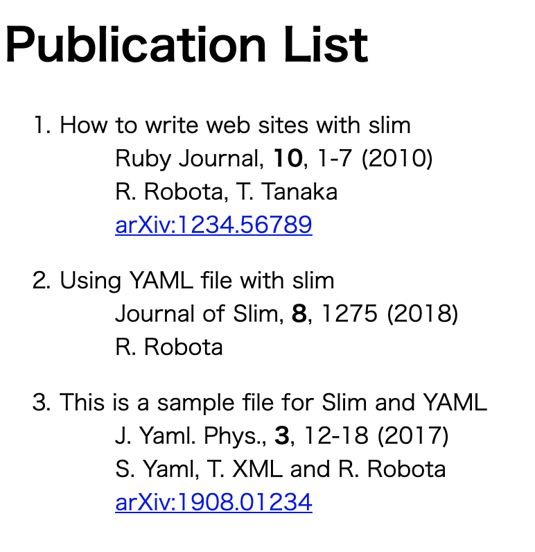

# YAMLとSlimで論文リストを作る

[](LICENSE)

## 概要

以下のようなYAMLファイル(`publication.yaml`)を食わせて、

```yaml
-
  title: How to write web sites with slim
  author: R. Robota, T. Tanaka
  journal: Ruby Journal
  year: 2010
  volume: 10
  page: 1-7
  arxiv: 1234.56789

-
  title: Using YAML file with slim
  author: R. Robota
  journal: Journal of Slim
  year: 2018
  volume: 8
  page: 1275

-
  title: This is a sample file for Slim and YAML
  author: S. Yaml, T. XML and R. Robota
  journal: J. Yaml. Phys.
  year: 2017
  volume: 3
  page: 12-18
  arxiv: 1908.01234
```

以下のようなHTMLを吐くSlimテンプレートのサンプルです。



## 使い方

ローカルにRubyとSlimがインストールされている必要があります。Rubyが入っていれば、

```sh
sudo gem install slim
```

でslimが入ると思います。

```sh
slimrb -v
```

で、Slimのバージョン情報が出てきたらインストールされています。

この状態で、

```sh
slimrb publication.slim -p > publication.html
````

とすると、`publication.yaml`

## 説明

Slimファイルの中身はこれだけです。

```slim
doctype html
html
  - require 'yaml'
  - require './myhash.rb'
  head
    title Publication List
  body
    h1 Publication List
    ol
      - YAML.load_file("publication.yaml").each do |d|
        li :dl
          dt = d.title
          dd == d.journal_ref
          dd = d.author
          - if d.arxiv
            dd == d.arxiv_ref
```

`YAML.load_file("publication.yaml")`でYAMLファイルをロードし、`each`でそれぞれのアイテムがハッシュでもらえるので、それに対してテンプレートを適用するだけです。ただ、いちいち`d["title"]`とかやりたくないので、`d.title`とすると`d["title"]`と書いたのと同じになるようにメソッドを追加しています。

```ruby
class Hash
  def method_missing(method, *args)
    key = method.to_s
    if self.has_key? key
      self[key]
    else
      false
    end
  end
def
```

Slimファイル内で、この`myhash.rb`も`require`しています。ついでに、`"#{journal}, <strong>#{volume}</strong>, #{page} (#{year})"`みたいなのもslimファイルに書きたくなかったので、それも`Hash`クラスに逃がしています。

```ruby
class Hash
  def journal_ref
    "#{journal}, <strong>#{volume}</strong>, #{page} (#{year})"
  end

  def arxiv_ref
    "<a href=\"https://arxiv.org/abs/#{arxiv}\">arXiv:#{arxiv}</a>"
  end
def
```

## ライセンス

MIT License. See [LICENSE](LICENSE).
